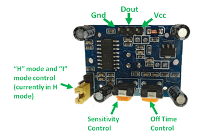

# Using PIR Sensor with STM32 DISCOVERY

In this project, we will use a **PIR (Passive Infrared) motion sensor** to control the **PD15** LED on the STM32 DISCOVERY board. The implementation will be done in two different ways:

- **Polling (Without Interrupts) Method**: Continuously checking PA0 pin in the main loop to control the LED.
- **Interrupt Method**: PA0 pin will trigger an interrupt when motion is detected, controlling the LED.

## What is a PIR Sensor?

PIR sensors are **passive infrared sensors** used for **motion detection**. They detect motion by sensing **infrared (IR) radiation** emitted by human bodies.

## PIR Sensor Pins

A standard PIR sensor, such as **HC-SR501**, has the following pins:

| Pin Name | Description |
|----------|------------|
| **VCC**  | 5V or 3.3V power supply |
| **OUT**  | Outputs **HIGH (1)** when motion is detected |
| **GND**  | Ground connection |

**Pin Layout Image:**
</br></br>



## PIR Sensor Potentiometers

PIR sensors typically have **two potentiometers** for adjustments:

1. **Sensitivity Adjustment:**
   - Controls the detection range.
   - Turning clockwise increases sensitivity.

2. **Time Delay Adjustment:**
   - Sets the duration of the output signal after motion detection.
   - Turning clockwise increases the delay time.

## Hardware Connections

| PIR Sensor | STM32 DISCOVERY |
|------------|----------------|
| VCC        | 3.3V           |
| GND        | GND            |
| OUT        | PA0            |

| LED (PD15) | STM32 DISCOVERY |
|------------|----------------|
| Anode      | PD15           |
| Cathode    | GND            |

## Code Explanation

### **Polling (Without Interrupts) Method**
In this method, the PA0 pin is continuously read to control the LED.

```c
#include "stm32f4xx.h"

void SystemClock_Config(void);
void GPIO_Init(void);

int main(void)
{
    HAL_Init();
    SystemClock_Config();
    GPIO_Init();

    while (1)
    {
        if(HAL_GPIO_ReadPin(GPIOA, GPIO_PIN_0) == GPIO_PIN_SET)
        {
    		  HAL_GPIO_WritePin(GPIOD, GPIO_PIN_15, GPIO_PIN_SET);
    		  HAL_Delay(500);
	      }else{
		      HAL_GPIO_WritePin(GPIOD, GPIO_PIN_15, GPIO_PIN_RESET);
	      }
    }
}
```

This method requires the processor to continuously monitor PA0, which consumes **more processing power**.

---

### **Interrupt Method**
In this method, when the PIR sensor detects motion, an **interrupt is triggered**, and the LED is turned on.

```c
#include "stm32f4xx.h"

void SystemClock_Config(void);
void GPIO_Init(void);
void EXTI0_IRQHandler(void);

volatile uint8_t is_movement = 0;


void HAL_GPIO_EXTI_Callback(uint16_t GPIO_Pin) {
    if (GPIO_Pin == GPIO_PIN_0) {
    	is_movement = 1;
    }
}


int main(void)
{
    HAL_Init();
    SystemClock_Config();
    GPIO_Init();

    while (1)
    {
         if (is_movement)
        {
          HAL_GPIO_WritePin(GPIOD, GPIO_PIN_15, GPIO_PIN_SET);
          HAL_Delay(100);
          HAL_GPIO_WritePin(GPIOD, GPIO_PIN_15, GPIO_PIN_RESET);
          is_movement = 0;
        }
    }
}

void GPIO_Init(void)
{
    __HAL_RCC_GPIOA_CLK_ENABLE();
    __HAL_RCC_GPIOD_CLK_ENABLE();
    __HAL_RCC_SYSCFG_CLK_ENABLE();

    GPIO_InitTypeDef GPIO_InitStruct = {0};

    // Configure PIR sensor (PA0) as input with interrupt
    GPIO_InitStruct.Pin = GPIO_PIN_0;
    GPIO_InitStruct.Mode = GPIO_MODE_IT_RISING;
    GPIO_InitStruct.Pull = GPIO_NOPULL;
    HAL_GPIO_Init(GPIOA, &GPIO_InitStruct);

    // Configure LED (PD15) as output
    GPIO_InitStruct.Pin = GPIO_PIN_15;
    GPIO_InitStruct.Mode = GPIO_MODE_OUTPUT_PP;
    GPIO_InitStruct.Pull = GPIO_NOPULL;
    GPIO_InitStruct.Speed = GPIO_SPEED_FREQ_LOW;
    HAL_GPIO_Init(GPIOD, &GPIO_InitStruct);

    // Configure EXTI (External Interrupt)
    HAL_NVIC_SetPriority(EXTI0_IRQn, 2, 0);
    HAL_NVIC_EnableIRQ(EXTI0_IRQn);
}
```

This method eliminates the need for continuous monitoring, making it **more efficient**.

---

## Conclusion
In this project, we implemented **motion detection using a PIR sensor** with an STM32 DISCOVERY board.

- **Polling method** keeps the processor busy but does not require interrupts.
- **Interrupt method** saves processing power and improves efficiency.

This project serves as a foundation for **motion detection systems** using PIR sensors.

---

### **Future Improvements**
- Use a buzzer with the PIR sensor to create a **security alarm system**.
- Transmit motion data via **UART or Bluetooth** to another device.
- Integrate **AI-powered image processing** for advanced detection.

---

**Author:** SERENGOKYILDIZ

